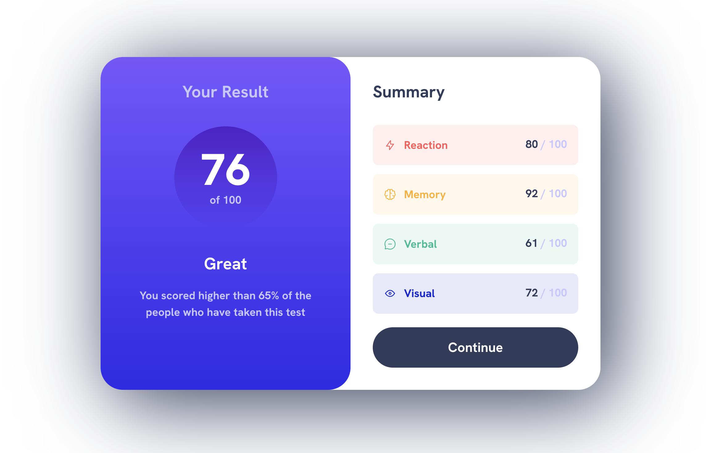

# Frontend Mentor - Results summary component solution

This is a solution to the [Results summary component challenge on Frontend Mentor](https://www.frontendmentor.io/challenges/results-summary-component-CE_K6s0maV). Frontend Mentor challenges help you improve your coding skills by building realistic projects.

## Table of contents

- [Overview](#overview)
  - [The challenge](#the-challenge)
  - [Screenshot](#screenshot)
  - [Links](#links)
- [My process](#my-process)
  - [Built with](#built-with)
  - [What I learned](#what-i-learned)
- [Author](#author)
- [Acknowledgments](#acknowledgments)

## Overview

### The challenge

Users should be able to:

- View the optimal layout for the interface depending on their device's screen size
- See hover and focus states for all interactive elements on the page

### Screenshot

### Links

- Solution URL: [https://github.com/asitha/web-dev-samples/tree/main/components/results-summary-component](https://github.com/asitha/web-dev-samples/tree/main/components/results-summary-component)
- Live Site URL: [https://asitha.github.io/web-dev-samples/components/results-summary-component](https://asitha.github.io/web-dev-samples/components/results-summary-component)

## My process

### Built with

- Semantic HTML5 markup
- CSS custom properties
- Flexbox
- Mobile-first workflow

### What I learned

- For this challenge I used the CSS reset from [Josh Comeau](https://www.joshwcomeau.com/css/custom-css-reset/)
- I used the visually hidden class from [Scott O'Hara](https://www.scottohara.me/blog/2017/04/14/inclusively-hidden.html) to add assistive texts for the screen readers.

## Author

- Website - [http://asitha.github.io](https://asitha.github.io)
- Frontend Mentor - [@Asitha](https://www.frontendmentor.io/profile/Asitha)

## Acknowledgments

Thanks [Kevin Powell](https://www.youtube.com/@KevinPowell) for the video about the CSS. Learning a lot from you.
